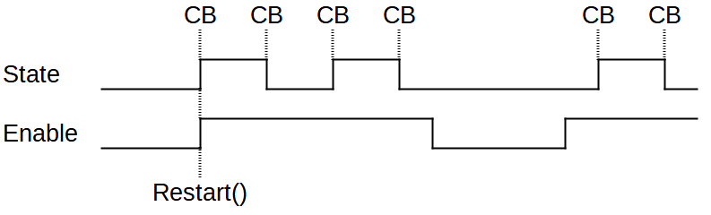
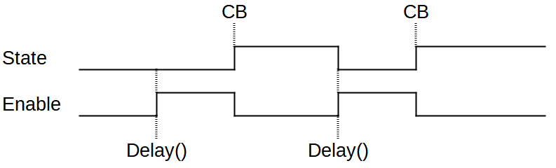

# NE555

Simulation of the function from a NE555 timer chip. ;)

* State change with defined interval time, without stopping the ```loop()``` like ```Delay()```.
* State change calls a defined callback function.
* Enable allow to freeze and resume the timer.
* High and low state timing are undependent.

There are 2 modes: Pulse and delay.
### PULSE


### DELAY


## INSTALLATION & DOWNLOAD
Install via the Arduino Library Manager, the PlatformIO Library Manager or download from [github](https://github.com/Gfy63/NE555.git)

## BASIC USAGE

### INSTANTIATE

```cpp
#include <NE555.h>

#define pinBlink 	13

void BlinkCB( boolean state );

NE555 blink( <hightTimer>, <lowTimer>, <Callback> );

// Create callback function
void BlinkCB( boolean state )
{
    digitalWrite( pinBlink, state );
}
```

### SETUP

```cpp
blink.restart();            // Restart & enable timer.
```

### LOOP

```cpp
blink.inspect();
```
Inspect the delayed time and change state if expired and call the callback function if used.
First call fires always the callback function with state by high.

## Constructors
Construct a blink function. (No callback function used)
```cpp
NE555 blink( 1000 );
```
Construct a flash function. (no callack function used) 
(```intervalH``` and ```intervalL``` are the same)
```cpp
NE555 blink( 100, 900 );
```
Construct a blink function with callback function.
```cpp
NE555 blink( 1000, BlinkCB );
```
Construct a flash function with callback function.
(```intervalH``` and ```intervalL``` are the same)
```cpp
NE555 blink( 100, 900, BlinkCB );
```

## Setup method
Normally called from within ```setup()``` but can be updated at runtime.

```void enable( boolean enb )``` False freeze the timer and resume with true.

```boolean enable()``` Get the enable.

```void restart()``` Restart the timer. State and enable are set to true and on the next ```inspect()``` the callback function is called.

```void delay( unsigned long t )``` Start delay. State is false, enable set to true. After the delay time the callback function is call one time. ```intrlavL``` is used for the delay time.

```void interval( unsigned long inv )``` Set the interval time for high and low state in ms.

```void intervalH( unsigned long invH )``` Set the interval time for high state in ms.
```unsigned long intervalH( void )``` Get the interval time for high state.

```void intervalL( unsigned long invL )``` Set the interval time for low state in ms.
```unsigned long intervalL( void )``` Get the interval time for low state.

## Loop method
This is the only method to be call from the loop.
```void inspect()``` check the timer, and if it is expired, the callback function is fired.

## Callback function
After the interval time is elapsed, the callback function is called.

Format: ```void cb( boolean state )```